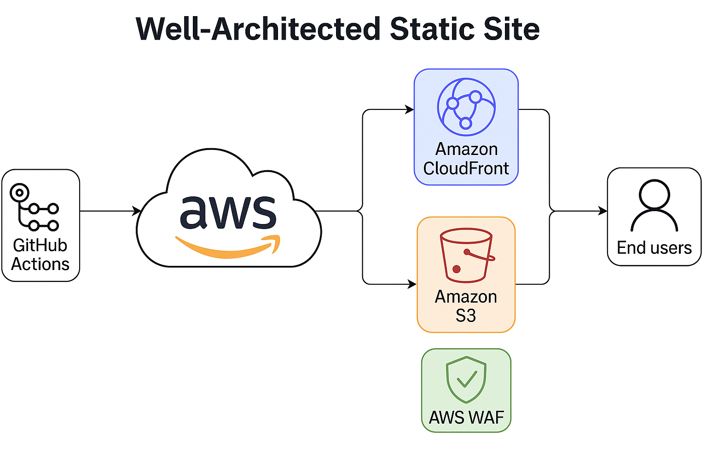

# ☁️ Well‑Architected Static Site (AWS + Terraform)

A **reproducible, secure, and cost‑efficient static website** deployment built on AWS.  
This project demonstrates the **AWS Well‑Architected Framework** across all five pillars, using **Terraform** and **GitHub Actions (OIDC)** to manage a modern static site pipeline.

> **Primary Region:** **eu‑west‑2 (London)** · **Global/US‑East:** **us‑east‑1** for ACM, CloudFront and WAF.

---

## 🧩 Overview

**Goal:** Build and operate a production‑grade static site following AWS best practices — deployable via a single `terraform apply` and fork‑friendly.

**Core services:**
- **Amazon S3 (private, eu‑west‑2)** – static origin with access logging
- **Amazon CloudFront (global + OAC)** – CDN + TLS termination + security headers
- **AWS WAFv2 (CLOUDFRONT)** – managed protections, logs to S3 (**us‑east‑1**)
- **AWS Certificate Manager (us‑east‑1)** – DNS‑validated cert for CloudFront
- **AWS Route 53** – DNS and ACM validation
- **GitHub Actions (OIDC)** – CI/CD with short‑lived creds
- **Terraform (IaC)** – declarative provisioning + tagging

---

## 🏗️ Project Structure

```
well-architected-static-site/
├── site/
│   ├── index.html
│   ├── 404.html
│   ├── robots.txt
│   └── .well-known/security.txt
│
├── terraform/
│   ├── main.tf            # modules + providers (eu‑west‑2 + us‑east‑1 alias)
│   ├── variables.tf       # inputs (project_name, domain, etc.)
│   ├── outputs.tf         # outputs (bucket, CF dist, role ARN, etc.)
│   └── backend.tf         # remote state + locking (optional)
│
├── .github/workflows/
│   └── deploy.yml         # OIDC assume role → sync /site → CF invalidation
│
├── docs/
│   └── architecture.png   # CloudFront–S3–WAF–OIDC diagram
│
├── Makefile               # quality-of-life targets
├── terraform.auto.tfvars.example
└── README.md              # (this file)
```

---

## 🧭 Architecture Diagram



---

## 🚀 Key Features

### 🔐 Security
- **CloudFront OAC** for private S3 origin access (no public buckets)
- **Strict HTTPS** (`redirect-to-https`), modern **Response Headers Policy** (CSP, HSTS, Frame‑Options, Referrer‑Policy, X‑Content‑Type‑Options, Permissions‑Policy)
- **AWS WAFv2** managed rule groups (CRS, IP reputation, Bot Control)
- **Server‑side encryption (AES‑256)** on all buckets
- **IAM least‑privilege** role for GitHub OIDC deployments
- **Public metadata**: `robots.txt` and `.well-known/security.txt`

### ⚙️ Reliability
- **Infrastructure‑as‑Code** with remote state + locking
- **Versioned S3 buckets** and lifecycle policies
- **Custom 404** and `www → apex` redirect via CloudFront Function

### ⚡ Performance Efficiency
- **Cache strategies** (HTML vs assets), compression enabled
- **PriceClass_100** for cost‑aware edge footprint

### 💰 Cost Optimisation
- **Budgets** with email alerts
- S3 lifecycle expiries for logs and versions
- Serverless hosting + automatic teardown steps

### 🧠 Operational Excellence
- **CI/CD**: OIDC assume‑role → sync site → invalidate CloudFront
- **Validation/linting** pipeline ready (fmt/validate, TFLint, Checkov)
- Clear troubleshooting and cleanup guidance

---

## 1) Prerequisites

- Terraform **>= 1.6**
- AWS CLI with permissions for IAM, S3, CloudFront, WAF, ACM, Route 53
- Route 53 hosted zone for your domain (e.g., `example.com`)
- (Optional) GitHub repository for CI/CD

```bash
aws sts get-caller-identity
terraform -version
```

---

## 2) Quick Start (works on forks)

From the repo root:

```bash
cd terraform
cp ../terraform.auto.tfvars.example ./terraform.auto.tfvars
# edit domain_name, budget_email, etc.

terraform init
terraform apply -auto-approve
```

When `apply` completes, note these **outputs**:
- `deploy_role_arn` – IAM role for GitHub OIDC
- `cloudfront_url` – temporary access while DNS propagates
- `bucket_name` / `logging_bucket_name` – S3 buckets in eu‑west‑2

> **Bucket uniqueness:** names are global; this stack appends a **short random suffix** at deploy time to avoid reuse conflicts.

---

## 3) Variables

```hcl
# terraform.auto.tfvars
domain_name          = "example.com"
enable_custom_domain = true
budget_email         = ["you@example.com"]
project_name         = "wa-static-site" # short hex suffix is added automatically
```

---

## 4) CI/CD (GitHub Actions + OIDC)

After `terraform apply`, set in your GitHub repo:

- `GH_DEPLOY_ROLE_ARN` = value of `deploy_role_arn` output

Workflow excerpt:
```yaml
- name: Configure AWS credentials
  uses: aws-actions/configure-aws-credentials@v4
  with:
    role-to-assume: ${ vars.GH_DEPLOY_ROLE_ARN || secrets.GH_DEPLOY_ROLE_ARN }
    aws-region: eu-west-2
```
Ensure the branch pattern in the OIDC trust matches your workflow branch (e.g., `refs/heads/main`).

---

## 5) What Gets Created

- **S3 (eu‑west‑2)**: private site bucket (OAC‑only), logs bucket (lifecycle, SSE, PAB)
- **CloudFront (global)**: OAC, response headers policy, default root object, optional `www → apex` redirect
- **ACM (us‑east‑1)**: DNS‑validated certificate for apex + www
- **WAF (CLOUDFRONT)**: managed rules, logging to S3 in **us‑east‑1**
- **Route 53**: A/AAAA aliases for apex and www
- **Budgets**: monthly cost budget with email notifications

---

## 6) Deploying Site Content

Using Terraform outputs:

```bash
BUCKET=$(terraform output -raw bucket_name)
DISTID=$(terraform output -raw cloudfront_distribution_id)

aws s3 sync ../site "s3://$BUCKET" --delete --acl private --region eu-west-2
aws cloudfront create-invalidation --distribution-id "$DISTID" --paths "/*"
```

---

## 7) Troubleshooting

- **ACM Pending validation**
  - Confirm Route 53 created `_acme-challenge` CNAMEs in the correct zone
  - Certificate **must** be in **us‑east‑1** for CloudFront

- **S3 bucket creation hangs or “already exists”**
  - Bucket names are global; AWS may reserve names briefly after deletion
  - This stack appends a random suffix; re‑run `apply` if AWS had a transient delay

- **OIDC assume‑role fails in Actions**
  - Verify `GH_DEPLOY_ROLE_ARN` and matching branch in the OIDC `sub`
  - Audience is `sts.amazonaws.com`; provider thumbprint matches GitHub

- **Destroy fails (non‑empty buckets)**
  - Empty buckets first; use the provided Makefile target

```bash
make empty-buckets
terraform destroy -auto-approve
```

---

## 8) Costs & Cleanup

**Costs:** Hosted zone, CloudFront transfer/requests, WAF managed rules, S3 storage/requests (Budgets is free).  
**Cleanup:**

```bash
make empty-buckets
terraform destroy -auto-approve
```

---

## 9) Makefile Shortcuts

```bash
make init          # terraform init
make plan          # terraform plan
make apply         # terraform apply -auto-approve
make outputs       # terraform output
make empty-buckets # empties site/logs (eu‑west‑2) + WAF logs (us‑east‑1)
make destroy       # empties & destroys
```

---

## 📊 Well‑Architected Pillar Mapping

| Pillar | Implementation Highlights |
|---|---|
| **Security** | OAC, TLS, WAFv2, strict headers, encryption, least‑privilege IAM |
| **Reliability** | IaC, versioning, remote state/locking, DNS validation |
| **Performance** | Cache policies, compression, PriceClass_100 |
| **Cost Optimisation** | Budgets, lifecycle, serverless hosting |
| **Operational Excellence** | CI/CD, validation, clear runbooks |

---

## 👤 Author

**Gregory John Carberry** · [LinkedIn](https://www.linkedin.com/in/gregory-carberry) · [GitHub](https://github.com/GregoryCarberry)

**Last verified:** *2025-10-29*
