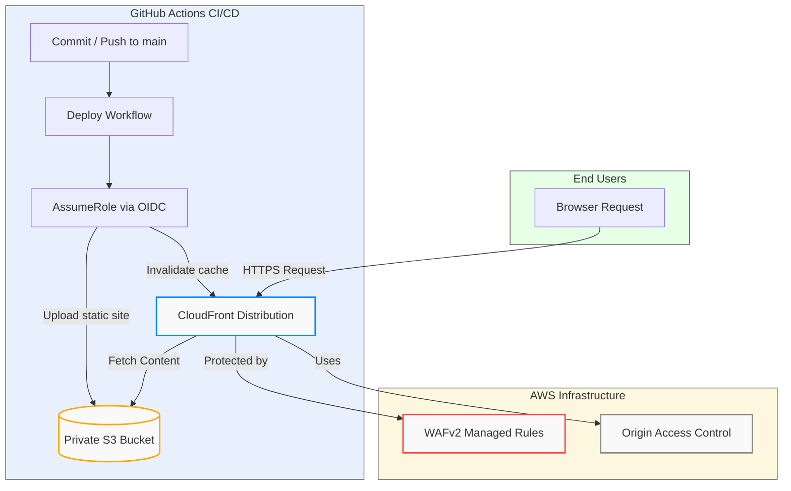

```mermaid
graph TD
    subgraph GitHub[GitHub Actions CI/CD]
        A1["Commit / Push to main"] --> A2["Deploy Workflow"]
        A2 --> A3["AssumeRole via OIDC"]
        A3 -->|Upload static site| S3Bucket
        A3 -->|Invalidate cache| CFDistribution
    end

    subgraph AWS[AWS Infrastructure]
        S3Bucket[(Private S3 Bucket)]
        CFDistribution[CloudFront Distribution]
        WAF[WAFv2 Managed Rules]
        OAC[Origin Access Control]
    end

    subgraph User[End Users]
        Browser[Browser Request]
    end

    Browser -->|HTTPS Request| CFDistribution
    CFDistribution -->|Fetch Content| S3Bucket
    CFDistribution -->|Uses| OAC
    CFDistribution -->|Protected by| WAF

    style S3Bucket fill:#f9f9f9,stroke:#ffa500,stroke-width:2px
    style CFDistribution fill:#f9f9f9,stroke:#0088ff,stroke-width:2px
    style WAF fill:#f9f9f9,stroke:#ff4444,stroke-width:2px
    style OAC fill:#f9f9f9,stroke:#888888,stroke-width:2px
    style GitHub fill:#e8f0fe,stroke:#555,stroke-width:1px
    style AWS fill:#fef7e0,stroke:#555,stroke-width:1px
    style User fill:#e6ffe6,stroke:#555,stroke-width:1px
```
